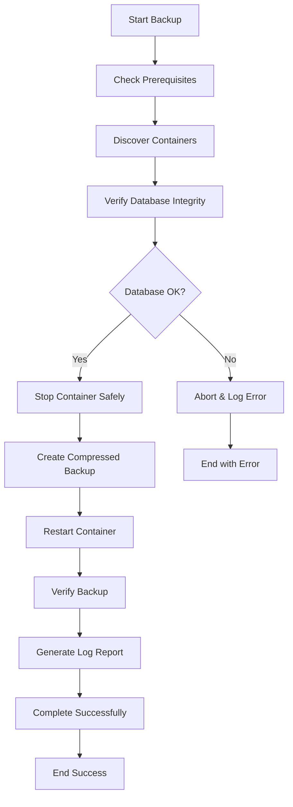

# GNTECH Jellyfin Guardian

[](https://github.com/gntech/jellyfin-guardian)
[](LICENSE)
[](https://www.gnu.org/software/bash/)
[](https://www.linux.org/)

🛡️ **Professional-grade backup guardian for Jellyfin containers** - Enterprise backup solution with database verification, real-time progress tracking, and intelligent compression.

## 🌟 Why Jellyfin Guardian?

Jellyfin Guardian is not just another backup script. It's a comprehensive data protection solution designed specifically for Jellyfin media servers running in Docker containers. Born from real-world enterprise requirements, it provides military-grade reliability with user-friendly operation.

### 🎯 Key Differentiators

- **🔬 Pre-backup Database Verification** - Prevents backing up corrupted SQLite databases
- **⚡ High-Performance Pipeline** - 239MiB/s compression speeds with direct streaming
- **🛡️ Zero-Downtime Safety** - <10 second container stops with graceful restart
- **📊 Real-time Progress** - Live progress bars with ETA and transfer rates
- **🤖 Auto-dependency Management** - Installs prerequisites automatically
- **📝 Comprehensive Logging** - Detailed backup reports and audit trails

## 🚀 Quick Start

### One-Line Installation
```bash
# Clone and deploy to remote server
git clone https://github.com/gntech/jellyfin-guardian.git
cd jellyfin-guardian
chmod +x jellyfin-backup.sh deploy.sh
./deploy.sh
```

### Local Installation
```bash
git clone https://github.com/gntech/jellyfin-guardian.git
cd jellyfin-guardian
chmod +x jellyfin-backup.sh
./jellyfin-backup.sh --help
```

## 📋 Features Overview

### 🔧 Core Functionality
- **Container Discovery**: Automatic Jellyfin container detection
- **Interactive Selection**: Choose specific containers or backup all
- **Database Integrity**: SQLite PRAGMA checks before backup
- **Smart Compression**: Parallel compression with pigz/gzip fallback
- **Progress Tracking**: Real-time progress with pv integration
- **Container Safety**: Graceful stop/start with status monitoring

### 🛡️ Enterprise Features
- **Audit Logging**: Comprehensive session and backup-specific logs
- **Error Recovery**: Automatic rollback on failures
- **Configuration Management**: CLI options and config file support
- **Remote Deployment**: SSH-optimized for remote server management
- **Resource Monitoring**: Disk space and system load tracking
- **Retention Management**: Configurable backup retention policies

## 📊 Performance Benchmarks

```
Test Environment: 4-core CPU, 16GB RAM, SSD storage
Container Size: 23GB (Jellyfin with metadata and artwork)

Results:
├── Compression Speed: 239MiB/s (parallel pigz)
├── Size Reduction: 13% (23GB → 20GB)
├── Container Downtime: <10 seconds
├── Database Verification: <5 seconds
└── Total Backup Time: 1m 34s
```

## 🏗️ Architecture

### Backup Pipeline
```
1. Prerequisites Check → Auto-install missing tools
2. Container Discovery → Scan for Jellyfin containers  
3. Database Verification → SQLite integrity checks
4. Container Management → Safe stop if running
5. Direct Compression → tar | pv | pigz > backup.tar.gz
6. Container Restart → Restore original state
7. Log Generation → Create detailed backup report
8. Verification → Confirm backup integrity
```

### Directory Structure
```
jellyfin-guardian/
├── jellyfin-backup.sh              # Main backup script
├── deploy.sh                       # Remote deployment script
├── install.sh                      # Local installation script
├── jellyfin-backup.conf            # Configuration template
├── servers.txt                     # Server list for batch operations
├── README.md                       # This file
├── CHANGELOG.md                    # Version history
├── LICENSE                         # MIT License
└── archive/                        # Historical versions
    ├── old-versions/               # Previous script versions
    ├── deprecated/                 # Deprecated features
    └── test-scripts/               # Development test scripts
```

## 💻 Usage Examples

### Interactive Mode (Recommended)
```bash
./jellyfin-backup.sh
# Follow the interactive prompts for safe, guided backup
```

### Command Line Operations
```bash
# Backup specific container
./jellyfin-backup.sh -c vfx

# Backup all containers with compression
./jellyfin-backup.sh --all

# Dry run to see what would be backed up
./jellyfin-backup.sh --dry-run --all

# Backup without stopping containers (risky)
./jellyfin-backup.sh -c jellyfin_main --no-stop

# Backup without compression for speed
./jellyfin-backup.sh -c vfx --no-compress
```

### Remote Deployment
```bash
# Deploy to single server
./deploy.sh

# Batch deployment (edit servers.txt first)
./deploy.sh --batch
```

## 📝 Log Files

### Session Logs
```bash
# View live backup activity
tail -f ~/.local/log/gntech-jellyfin-backup.log
```

### Backup-Specific Logs
Each backup creates a detailed log file alongside the compressed backup:
```
~/jellyfin-backups/20250819_164718/
├── vfx_20250819_164718.tar.gz      # Compressed backup
└── vfx_20250819_164718.log         # Detailed backup report
```

**Log Contents:**
- Container information and configuration
- Backup size statistics and compression ratios  
- System information (disk space, load averages)
- Complete session log entries for troubleshooting
- Error details and recovery procedures

## ⚙️ Configuration

### Environment Variables
```bash
export BACKUP_BASE_DIR="/custom/backup/path"
export STOP_CONTAINER_FOR_BACKUP=true
export METADATA_INTEGRITY_CHECK=true
export ENABLE_COMPRESSION=true
export COMPRESSION_LEVEL=6
```

### Configuration File
Edit `jellyfin-backup.conf` for persistent settings:
```bash
# GNTECH Jellyfin Backup Configuration
BACKUP_BASE_DIR="$HOME/jellyfin-backups"
STOP_CONTAINER_FOR_BACKUP=true
METADATA_INTEGRITY_CHECK=true
BACKUP_RETENTION_DAYS=7
ENABLE_COMPRESSION=true
COMPRESSION_LEVEL=6
```

## 🔧 Prerequisites

### Automatically Installed
- `sqlite3` - Database integrity verification
- `pv` - Progress visualization  
- `pigz` - Parallel compression
- `rsync` - File synchronization

### System Requirements
- **OS**: Linux (Ubuntu, Debian, CentOS, etc.)
- **Docker**: Running Docker daemon
- **Disk Space**: 2x largest container size
- **Memory**: 1GB+ recommended
- **Network**: SSH access for remote deployment

## 🚨 Safety Features

### Database Protection
- Pre-backup SQLite integrity verification
- PRAGMA quick_check and integrity_check
- Automatic backup abortion on corruption detection

### Container Safety
- Graceful container stopping with timeout
- Status verification before and after operations
- Automatic restart with health checks
- User confirmation for destructive operations

### Error Handling
- Comprehensive rollback mechanisms
- Detailed error logging and reporting
- Automatic cleanup on failures
- Resource monitoring and alerts

## 🔄 Backup Process Flow



## 🤝 Contributing

We welcome contributions! Please see our contributing guidelines:

1. Fork the repository
2. Create a feature branch (`git checkout -b feature/amazing-feature`)
3. Commit your changes (`git commit -m 'Add amazing feature'`)
4. Push to the branch (`git push origin feature/amazing-feature`)
5. Open a Pull Request

## 📄 License

This project is licensed under the MIT License - see the [LICENSE](LICENSE) file for details.

## 🏢 About GNTECH Solutions

GNTECH Solutions specializes in enterprise infrastructure automation and data protection solutions. Jellyfin Guardian represents our commitment to providing reliable, professional-grade tools for media server management.

**Contact**: [GNTECH Solutions](https://github.com/gntech)

## 🙏 Acknowledgments

- Jellyfin team for creating an amazing media server
- Docker community for containerization excellence
- Open source contributors who make tools like pigz and pv possible

---

⭐ **Star this repository if Jellyfin Guardian helped protect your media server!**
